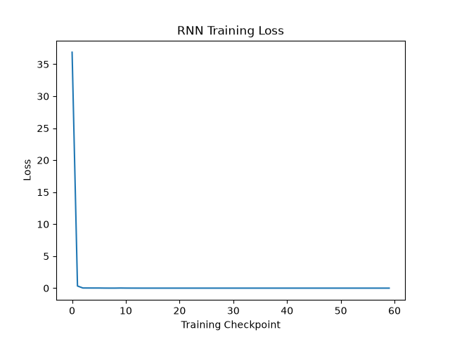

# RNN From Scratch

A vanilla Recurrent Neural Network (RNN) implemented from scratch using Python and NumPy.

The goal of this project is to understand how an RNN works internally without using high-level deep learning frameworks such as TensorFlow or PyTorch.

## Project Overview

This project trains a simple RNN to learn a sequential numerical pattern.

### Training Examples

| Input Sequence | Target |
|---|---:|
| [1, 2, 3] | 4 |
| [2, 3, 4] | 5 |
| [3, 4, 5] | 6 |
| [4, 5, 6] | 7 |
| [5, 6, 7] | 8 |

The model receives a sequence of three numbers and predicts the next number.

## RNN Architecture

The RNN processes the input one timestep at a time while maintaining a hidden state.

```text
x₁ → RNN → h₁
           ↓
x₂ → RNN → h₂
           ↓
x₃ → RNN → h₃
           ↓
        Output
           ↓
      Prediction

## Training Loss

The model successfully learns the numerical sequence, with the training loss decreasing rapidly during training.

